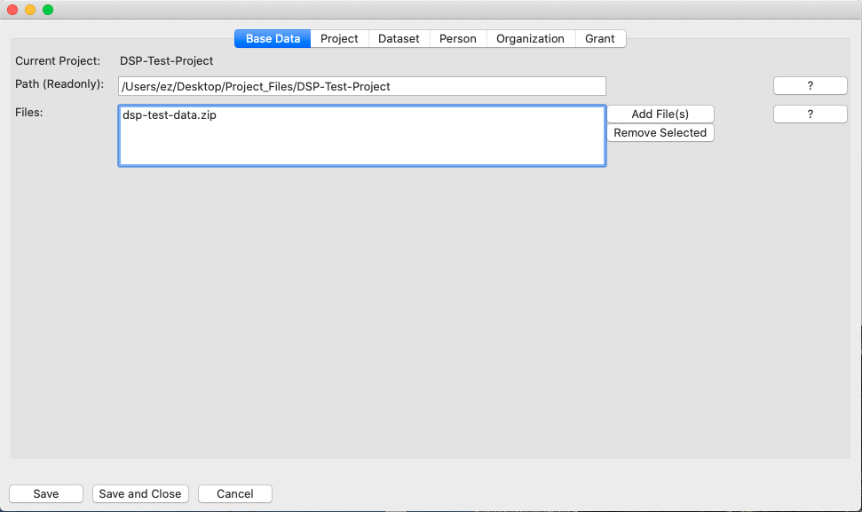

# Base Data Tab

## Current Project
The first line shows the current project. You cannot change the project name.

## Path (Readonly)
The second line shows the path of your project on the file system. Do not
move the folder once you have selected it. Should you have moved it 
unintentionally you may put it in place according to the path. 

Otherwise your files will not be uploaded to the server.

XX__This behaviour might be changed in later versions __XX

## Files
The third line shows which files you have selected for uploading. The 
buttons "Add File(s)" and "Remove Selected" allow you to add or remove
files.

XX__ Question: are the operations stored right away or do we need to 
confirm with save? __XX

Files may be of the following formats:
- Text
- Tabular data
- Data in tree or graph structures
- Images
- Audio and Video files
- PDF
- ZIP files containing the above data types data

See also: 
[DSP-API Introduction Data Formats](https://github.com/dasch-swiss/dsp-api/blob/main/docs/01-introduction/data-formats.md)
