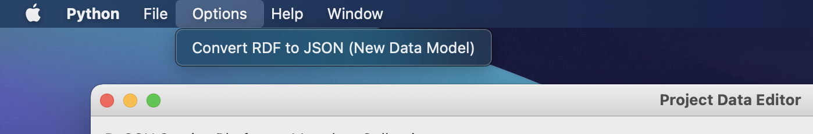
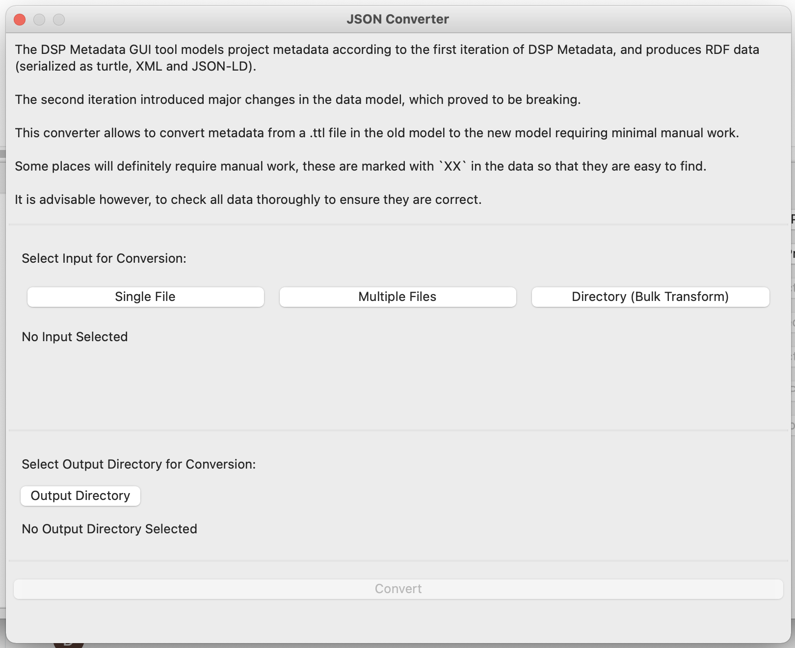

# Conversion to V2

The metadata generated by the application conforms to the first version of the data model for metadata.  
This corresponds to the data that can currently be viewed in the [DaSCH Metadata Browser](https://meta.dasch.swiss).

The initial data model will eventually be replaced by the model V2 which introduces major improvements.  
Metadata V2 will eventually be collected directly in the web interface rather than in this python application.  
In the mean time until the web interface for editing metadata is implemented, this application provides a script to automatically convert V1 `.ttl` files into V2 `.json` files.

## Model V2

The most important changes from V1 to V2 include the following additions:

- Support for multi-language literals

- `howToCite` on project level

- `country` property for addresses

- Creation and modification timestamps

- JSON schema validation

## Using the Conversion

To convert metadata from the old data model to the V2 model, follow these steps:

In the menu bar, click `Options > Convert RDF to JSON`.

This will open the conversion dialog.

Here you need to specify:

1. Which files to convert.
2. Where to save the converted files.

To select the files that should be converted, you have three options:

* `Single File`: Select a single Turtle file.
* `Multiple Files`: Select multiple Turtle files; use shift-click or control-click to select multiple files.
* `Directory (Bulk Transform)`: Select a folder and it will transform all Turtle files within this folder.

As output simply select a folder. The selected input file(s) will be converted and saved to this folder.  
The output files will retain the input file's name but the ending will be replaced from `.ttl` to `.json`.
If the output folder already contains a file whith such a name, it will get overwritten.
It is therefore advisable to select an empty folder.

Finally, hit the `Convert` button at the very bottom of the dialog.  
This button is greyed out as long as either the input or the output is missing. As soon as input and output are specified, the button gets enabled.

The conversion may take a while (especially if multiple files are being converted), the dialog will not be clickable during this time.
Once it's done the output folder should open up, and the conversion dialog can be closed.  
The process should not take more than a minute per file. On the console you should get minimal indication of the progress.

**NB:** The conversion requires a local `.ttl` file. It is therefore necessary to export the data after entering it, before it can be converted.

**NB:** Be sure to remember to review the data after the conversion. It will require manual post-processing, as described below.

## Manual Post-Processing

The conversion can not be fully automated, as the model V2 is more rich in information than V1.

For convenience, the conversion adds the string `XX` wherever the output can not be determined with sufficient confidence.
__Please check those instances manually.__  
Simply open the output file in a text editor and search for `XX`.

The conversion also does some "guessing" work, as e.g. the language of literal values or the display text for URLs.
If the output can be determined with a sufficient level of confidence, the conversion will ___not___ add `XX`.
__However it is still advisable to check the entirety of the output for potential errors.__

As the model V2 supports JSON schema validation, it is also advisable to open the output file in a text editor that supports JSON schema validation.
(E.g. Visual Studio Code which automatically validates JSON files that have a schema specified.)  
This will highlight potential issues with the data.  
> Note: The schema validates URLs as URIs. It will therefore consider URLs without scheme as invalid,
> i.e. `meta.dasch.swiss` will be highlighted as invalid, whereas `https://meta.dasch.swiss` will be valid.  
> These warnings can safely be ignored, or the schemes can be added to get rid of the warnings.
