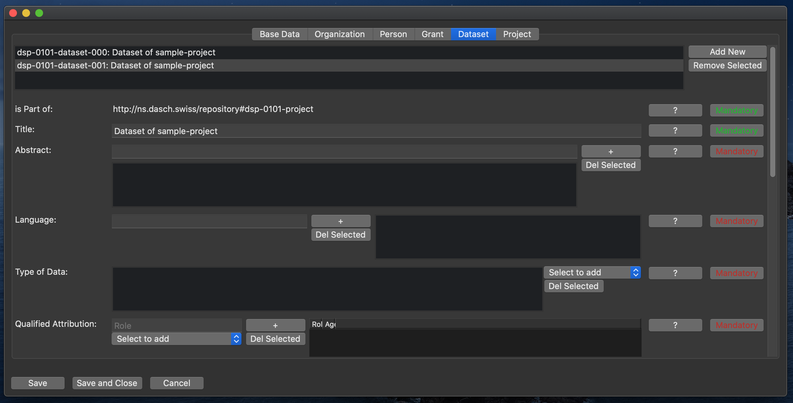

# Dataset

This class represents one (of potentially many) dataset of the project.

## Is Part of

Links the dataset to its project.  
_Note: This property is read-only and can not be changed._

## Title

The title of the dataset.  
(Mandatory.)

## Abstract

Abstract of the dataset.  
Can be the abstract text itself or a link to an abstract online.  
(Mandatory. Can have multiple values.)

## Language

The language the dataset is primarily written in.  
(Mandatory. Can have multiple values.)

## Type of Data

The type of data the dataset is primarily made up of.  
Select values from the drop-down. The available options are: XML, Text, Image, Movie, Audio.  
(Mandatory. Can have multiple values.)

## Qualified Attribution

Attribution of contributions to the dataset by people or organizations.  
A qualified attribution consists of a sub-property `agent` denoting the person or organization (select from the drop-down), and a sub-property `role`, denoting the role the person/organization had, within the project.  
(Mandatory. Can have multiple values.)

## License

The license terms under which the dataset is published.  
_Note: A URL to the license definition is expected._  
(Mandatory. Can have multiple values.)

## How to Cite

Recommendation, how the dataset should be cited.  
(Mandatory.)

## Conditions of Access

Access conditions of the dataset.  
Should normally be open access. A temporary embargo could be mentioned here too.  
(Mandatory.)

## Status

The status of the dataset within a project life cycle.  
Select values from the drop-down. The available options are: In planning, Ongoing, On hold, Finished.  
(Mandatory.)

## Alternative URL

Alternative URL of the dataset.  
This could for example include a link to a project specific website.  
(Optional.)

## Documentation

Documentation of the dataset.  
This can either be a documentation text or a link to an online documentation.  
(Optional. Can have multiple values.)

## Date Published

The publication date of the dataset.  
Use the date picker to select a date.  
(Optional.)

## Date Created

The date when the dataset was first collected.  
Use the date picker to select a date.  
(Optional.)

## Date Modified

The date when the dataset was last changed.  
Use the date picker to select a date.  
(Optional.)

## Distribution

Link to a download of the entire dataset.   
(Optional.)

