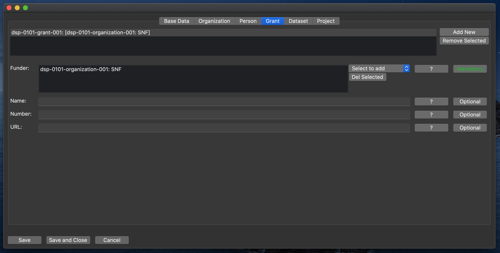

# Grant

This class represents financing granted to the project by a person or organization.

## Funder

The funding person or organization.  
Select a person or organization from the drop-down menu.  
(Mandatory. Can have multiple values.)

## Name

The name of the grant, if any (e.g. "Ambizione", "Eccellenza", etc.).  
(Optional.)

## Number

The number associated with the grant.  
(Optional.)

## URL

The URL of the grant.  
(Optional.)

