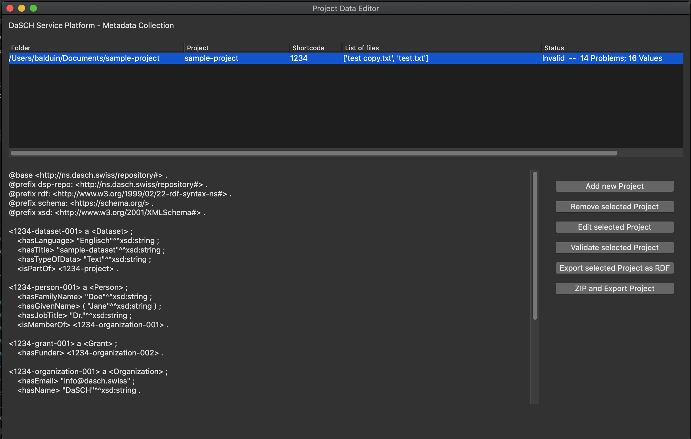

# Project Organization

The project organization window consists of three sections:

- On the top, there is a list of all projects.  
  If there are none, you will need to add one; otherwise the buttons are mostly greyed out.
- On the bottom left, there is a preview of the RDF representation of the selected project.
- On the bottom right, there are the buttons for the available actions to perform.  
  All buttons, except adding a new project, require a project to be selected. If not, they will be greyed out.

## Graphical User Interface

### Project List

The project list shows the available projects.

For each projects, it displays the associated folder, the project name, shortcode and a list of associated files. 
It also gives indication of the status, i.e. validity of the project and the number of missing properties.

### RDF Preview

The RDF preview displays a turtle serialization of the metadata of the selected project.

### Actions

The following actions can be performed:

- Add a new project  
  Adds a new project to the list.  
  To be able to add a project, you need to know its shortcode as well as associate a folder on your local file system with it. For details, see below.
- Remove a project  
  Removes the selected project from the list.
  _Note: This can not be undone._
- Edit a project  
  Opens the [form for collecting metadata](tabs_overview.md).
- Validate a project  
  Validates the selected project against the [ontology](https://github.com/dasch-swiss/dsp-ontologies/blob/main/dsp-repository/v1/dsp-repository.shacl.ttl).
- Export RDF data  
  Exports the selected project metadata as Turtle, RDF/XML and JSON-LD.  
  The files are stored in the folder associated with the project.
- Zip and Export  
  This action creates a Zip archive, containing all the files associated with the project, RDF serializations of the metadata, and a binary serialization of the project for reimport into this tool.

## Concepts

### Project Shortcode

The project shortcode is a four digit hexadecimal number that is assigned by the DaSCH to each project on the DSP.

To be able to add a project to the list, you need to enter the shortcode.

The shortcode can not be altered after the project has been created. 
Be sure to have the shortcode ready at hand when you want to add a new project. 
If you do not have a a shortcode for your project yet, please get in touch with the [DaSCH Client Services](mailto:info@dasch.swiss).

### Folder and Files

When adding a new project, after entering the project shortcode, you need to select a folder of your local file system, that is associated with the project.

___Note:___ _Do not move or remove that folder, it might cause you to lose all data related to this project - or in the worst case, cause the tool to crash._

## Local Data Storage

The metadata tool stores all data (except data you export) as binary data in the file `~/DaSCH/config/repos.data`.

If you want to back up your working data, be sure to make backups uf this file as well as all folders you associated with projects.

Deleting this file will remove all projects and cause irreversible loss of all data you have entered.

When the tool has a major update with breaking changes to the API, you will need to delete this file manually.
