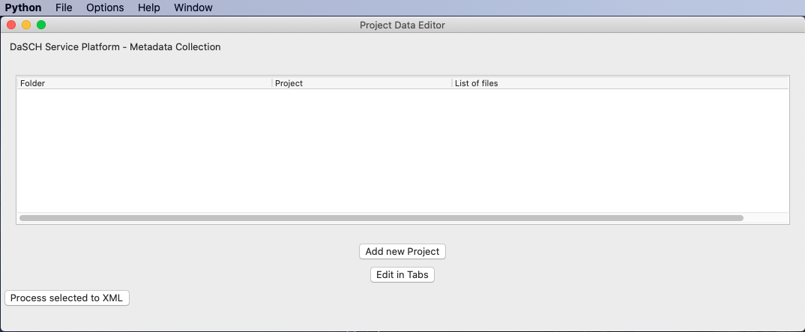

# List view

List view is the first window you will see after starting the tool. In List View you have a Menu Bar (top of the screen), an empty list window, 
and the buttons "New Folder", "Edit in Tabs" and "Process selected to XML".

The Menu Bar shows "File", "Option", "Help", and "Window".  

### Menu Entry "File"

"File" provides you to open your project (in case you work for an organization, 
which deals with several projects, you can open several projects). "New Folder" in
"File" opens a dialog box allowing you to select the folder with your project. 
We presume your project folder has the name of your project in abbreviated form.

Your project folder should contain your project files (zip, xml, et cetera.). 

After you have selected the project folder, it appears in the "List". The "List" has 
three columns: "Folder", "Project", and "List of Files". The "Folder" entry shows the path
of your project on the file system in absolute notation, the "Project" entry shows your 
project, and the "List of Files" entry shows your files. 
[See also Before you start](prep.md)

### Button "New Folder"

The button "New Folder" works likewise to the "Menu" "New Folder" dialogue.
[See also Before you start](prep.md)

### Button "Edit in Tabs"

Select your project and click "Edit in Tabs" to process your data further. This will lead
you to the Tabbed View. A second window will be opened (see [overview](prep.md))

### Button "Process selected in XML"

Once you are finished with collecting your metadata and all mandatory form fields are filled
in and you have green light (Flag "mandatory" is typed in green colour) you may process your 
project to RDF/XML. 

**More to come...**
