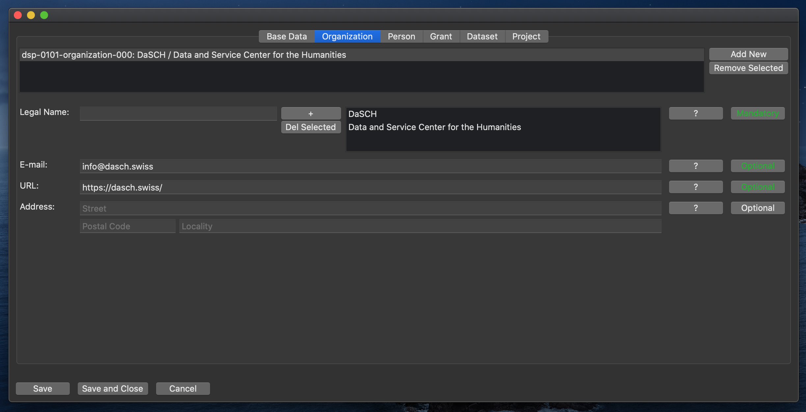

# Organization

This class represents an organization or legal body.

## Legal Name

The name of the organization.  
(Mandatory. Can have multiple values.)

## E-Mail

The contact e-mail address of the organization.  
(Optional.)

## URL

The website of the organization.  
(Optional.)

## Address

The postal address of the organization.  
(Optional.)

Consists of three sub-properties: Street, postal code, locality.

