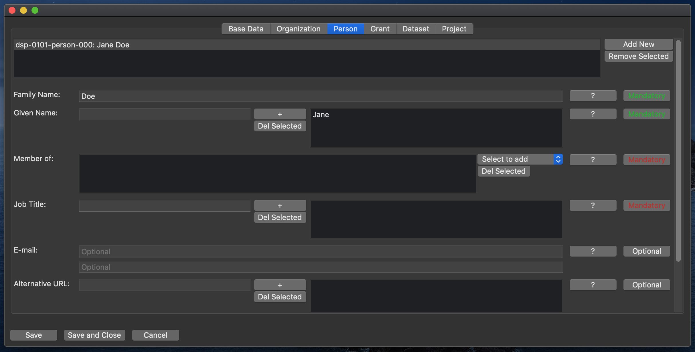

# Person

This class represents a person.

## Family Name

The family name of the person.
(Mandatory.)  
_Note: One value only. If multiple are required, use semicolon to separate them._

## Given Name

The given name of the person.  
(Mandatory. Can have multiple values.)

## Member of

The affiliation of the person.  
Select an organization from the drop-down menu.  
(Mandatory. Can have multiple values.)

## Job Title

The job title or position of the person in the context of the project.  
(Mandatory. Can have multiple values.)

## E-Mail

The contact e-mail address of the person.  
(Optional.)

## Alternative URL

Entry in an authority file. (e.g. ORCID, VIAF, GND)  
(Optional. Can have multiple values.)

## Address

The postal address of the person.  
(Optional.)

Consists of three sub-properties: Street, postal code, locality.

