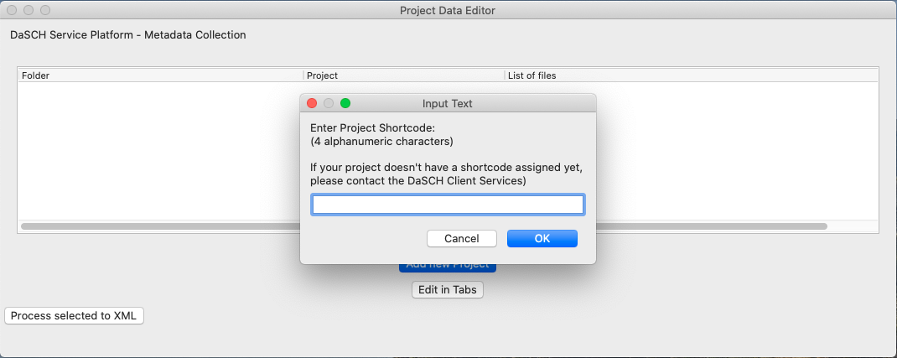

<!---
Copyright © 2015-2019 the contributors (see Contributors.md).

This file is part of Knora.

Knora is free software: you can redistribute it and/or modify
it under the terms of the GNU Affero General Public License as published
by the Free Software Foundation, either version 3 of the License, or
(at your option) any later version.

Knora is distributed in the hope that it will be useful,
but WITHOUT ANY WARRANTY; without even the implied warranty of
MERCHANTABILITY or FITNESS FOR A PARTICULAR PURPOSE.  See the
GNU Affero General Public License for more details.

You should have received a copy of the GNU Affero General Public
License along with Knora.  If not, see <http://www.gnu.org/licenses/>.
-->

# Before you start

Before you start with collecting data to your project in the DSP-metadata-tool **make 
sure you have the alphanumeric shortcode of your project**. You get the shortcode of your project 
from the DaSCH Client Services. The shortcode cannot be changed afterwards, so we prevent you from 
starting without a shortcode. Be sure you have the correct shortcode. Ask the DaSCH Client Services
before entering to get the alphanumeric shortcode provided for your project.
<!-- Will there be a contact point given? -->

[List view](list_view.md)

Tabbed view

- [Tabs overview](tabs_overview.md)
- [Base Data](basedata.md)
- [Project](project.md)
- [Data](data.md)
- [Person](person.md)
- [Organization](organization.md)
- [Grant](grant.md)
