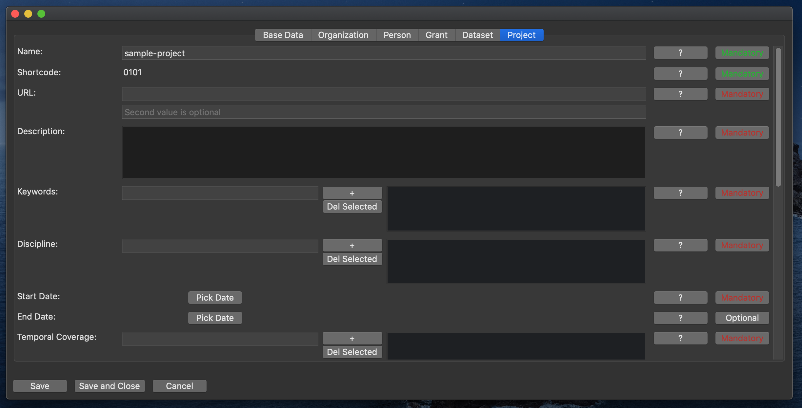
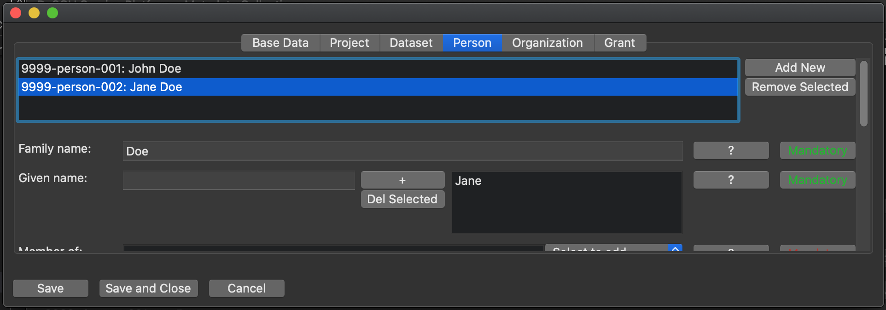
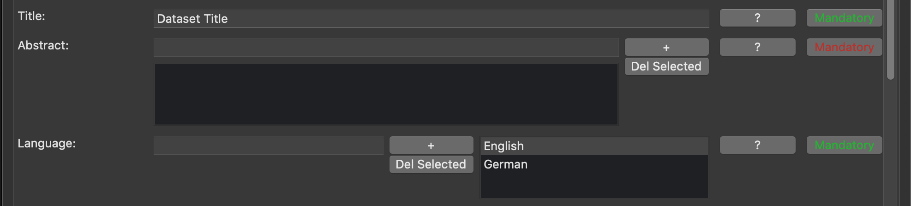
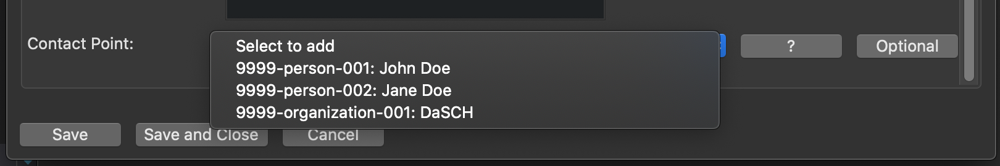

# Entering Metadata

When you select to edit a project, a new window opens.
This window allows you to enter and modify the project metadata.
It is divided in a number of tabs.

At any given time, you can save the data you entered and close the window with or without saving, using the buttons on the bottom of the window.

## Base Data Tab

The first tab shows the project's base data. Here, you can associate or dissociate files with the project.  
(For details, see [here](list_view.md#folder-and-files).)

## Metadata Tabs

All other tabs each correspond to a top level class in the metadata, and share the same general layout.

There is a row for each property.  
The value(s) of the property can be edited in the middle.  
Furthermore, there are two buttons to show further information on the property:  
The button labeled "?" explains what is meant by the property, i.e. what kind of value is expected.
If available, there is also a simple, imaginary example.  
The button labeled either "Mandatory" or "Optional" gives validation information on the current value.
The colors indicate, wether or not the value is valid (green = valid; red = invalid; gray = no value entered for optional property).
For some more information why the value is (in)valid, click the button.

## Classes/Tabs

The metadata consist of instances of classes. Each complex class has a corresponding tab in the GUI, where instances of the class can be organized and edited.

Classes have properties, that can either be literal values (e.g. strings, URLs, etc.) or references to instances of other classes (e.g. a dataset being belonging to a project).

### Project

The project is the only class of which there can only be one, in the metadata.
The tab therefor does not have the list of multiple instances.

This class holds all information that is representative of the entire project.

### Dataset

There can be multiple datasets.

A project hosted on the DSP must have one or multiple datasets.

### Person

There can be multiple persons.

This class represents a person that contributed to the project.

### Organization

There can be multiple organizations.

This class represents an organization that contributed to the project.

### Grant

There can be multiple grants.

This class represents a financial grant that was granted to the project.

## Properties, Cardinalities, Values

### Multiple Instances of a Class

All classes, except the project, can have multiple instances.
E.g. there will be multiple people contributing to a project.

Where this is the case, the tab shows a list at the very top, representing all instances of the class.
Additional instances can be added and existing instances can be removed with the buttons next to it.

Once there are multiple instances, select the one you want to work on in the list.
You can only edit properties of the instance that is currently selected.

### Cardinalities

Each property of a class has a defined cardinality, as defined in the ontology.

Generally, a property can either be `optional` or `mandatory`.

Furthermore, a property can either be restricted to occur only once, or it can potentially occur multiple times. (Combined, several cardinalities are possible, e.g. `1`, `0-1`, `0-n`, `1-n` but also `1-2` etc.)

Except for some cases that should be self-explanatory, the GUI mostly differentiates between properties that can occur maximum one time, and properties that can occur multiple times.  
Where only one value is expected, there will only be an input field. Where multiple values can occur, there is an input field, a list of all values and buttons to add and remove values to/from the list.  
___Note:___ _A value is only added to the list, once the "+" button is pressed or enter is hit._  
For an example, see the image below: While a dataset can only have one title, it may consist of multiple languages.

### Values

Generally, the value of a property can either be a text-like value (e.g. Text, URLs, etc.), or it can link another object (Dataset, Project, Person, etc.).

Text-like values are represented as text fields in the GUI. The value can simply be typed in.  
Object links are represented as dropdown lists in the GUI. The dropdown shows all objects that can be referenced in this place. The linkable objects can be created and modified in their respective tab.

Example: A Project can have either a person or an organization as a point of contact.

